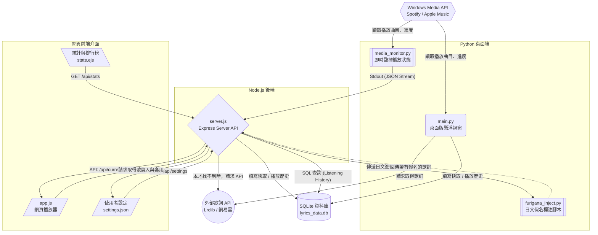

```mermaid
graph TD
    %% 外部系統與 API (六角形與圓形)
    OS{{Windows Media API <br> Spotify / Apple Music}}
    WebAPI((外部歌詞 API <br> Lrclib / 網易雲))
    
    %% 資料庫 (圓柱體)
    DB[(SQLite 資料庫 <br> lyrics_data.db)]

    %% Python 核心組件 (副程式/帶有雙邊的矩形)
    subgraph Python 桌面端
        MM[[media_monitor.py <br> 即時監控播放狀態]]
        Furi[[furigana_inject.py <br> 日文假名標註腳本]]
        PyCore(main.py <br> 桌面版懸浮視窗)
    end

    %% Node.js 伺服器
    subgraph Node.js 後端
        Express{server.js <br> Express Server API}
    end

    %% 網頁前端介面 (平行四邊形/梯形)
    subgraph 網頁前端介面
        WebApp[/app.js <br> 網頁播放器/]
        StatsUI[\統計與排行榜 <br> stats.ejs\]
        SettingsUI[/使用者設定 <br> settings.json/]
    end

    %% 流程與資料流向
    OS -- "讀取播放曲目、進度" --> MM
    OS -- "讀取播放曲目、進度" --> PyCore
    
    MM -- "Stdout (JSON Stream)" --> Express
    Express -- "API: /api/current-media" --> WebApp
    
    WebApp -- "請求取得歌詞" --> Express
    PyCore -- "請求取得歌詞" --> WebAPI
    
    Express -- "本地找不到時，請求 API" --> WebAPI
    Express -- "傳送日文進行注音處理" --> Furi
    Furi -. "回傳帶有假名的歌詞" .-> Express
    
    Express -- "讀寫快取 / 播放歷史" --> DB
    PyCore -- "讀寫快取 / 播放歷史" --> DB
    
    StatsUI -- "GET /api/stats" --> Express
    Express -- "SQL 查詢 (Listening History)" --> DB
    
    SettingsUI -- "POST /api/settings" --> Express
    Express -- "寫入與套用" --> SettingsUI
```
