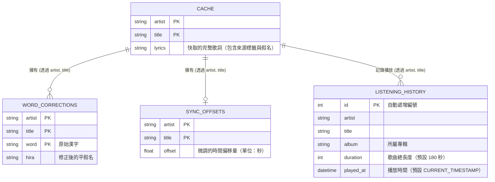
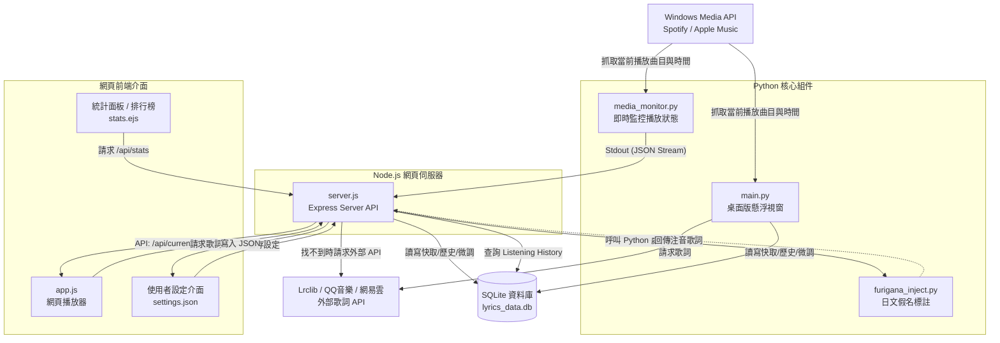

# Floating Lyrics - Mermaid 原始碼

你可以將以下的原始碼複製並貼上到 [Mermaid Live Editor](https://mermaid.live/) 或其他支援 Mermaid 的編輯器（如 Notion, Obsidian）中。

## 1. 資料庫實體關聯圖 (ER Diagram)

## 2. 系統架構與資料流程圖 (System Flow Chart)

