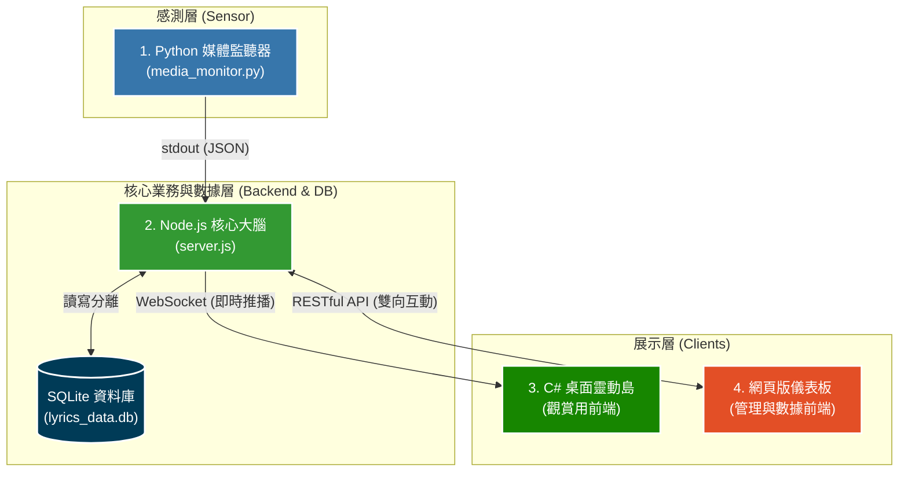
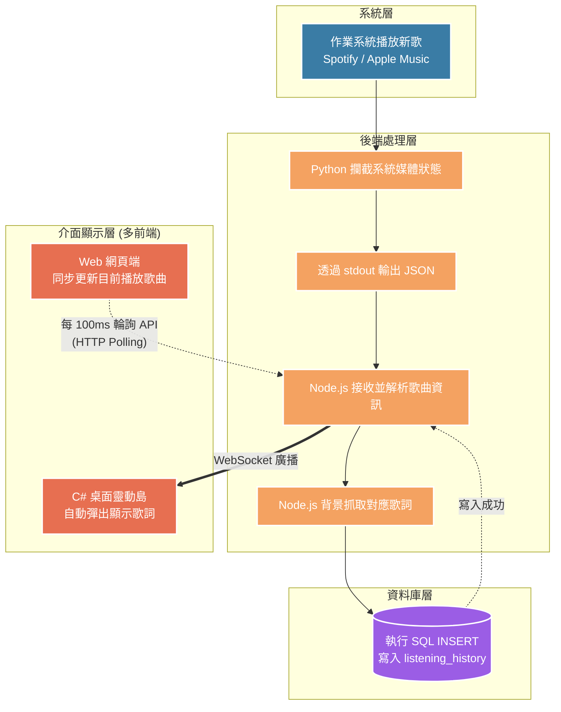
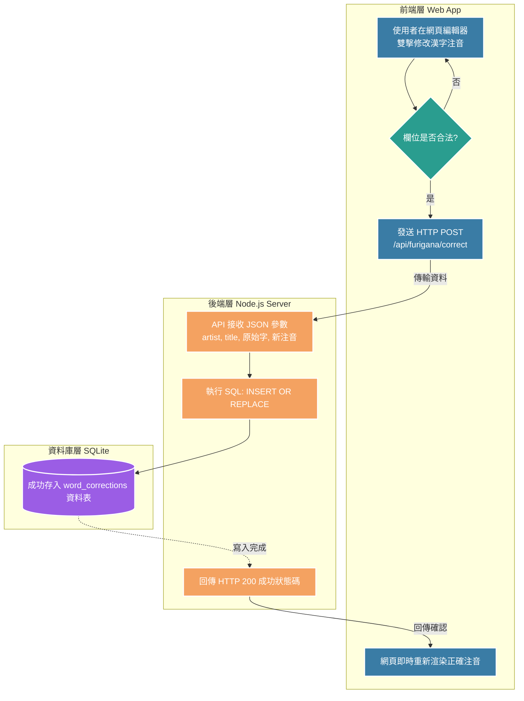
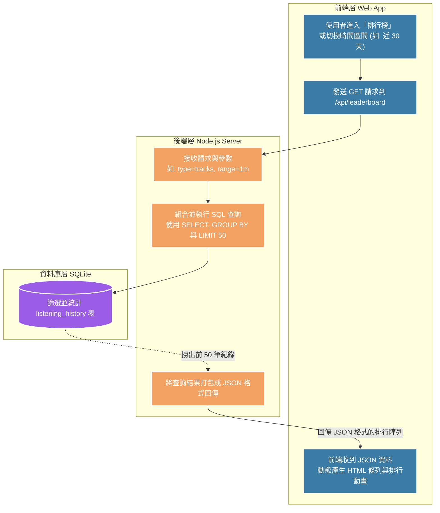
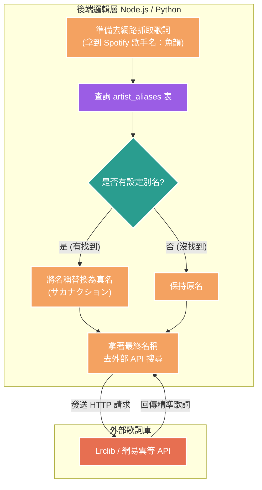

# Floating-Lyrics: 跨平台動態歌詞與聽歌分析系統

本專案是一個具備日文假名標註、多來源歌詞抓取與全域快捷鍵的動態歌詞系統。
專案經歷了從「單體架構 (Monolithic)」到「微服務架構 (Microservices)」的演進，目前整合了 **Python 系統監聽**、**Node.js 核心大腦**、**C# WPF 桌面白月光靈動島** 與 **Web 網頁數據中心**，達成高度的模組化與關注點分離。

## 🌟 專案主要功能統整

1.  **C# 桌面靈動島歌詞**：在桌面上以極致流暢的 C# WPF 動畫顯示同步歌詞與專輯封面，不干擾其他工作。
2.  **自動偵測系統音樂**：透過 Python 攔截 Windows 原生 API，免金鑰自動監聽並同步 Spotify、Apple Music 等播放器的歌曲資訊。
3.  **日文漢字注音 (Furigana)**：內建日文分詞與拼音轉換系統，能自動為日文漢字加上平假名/羅馬音標註。
4.  **多重歌詞來源抓取**：Node.js 後端整合多種歌詞服務平台 (包含 QQMusic 等備用方案)，自動搜尋並下載準確的動態歌詞。
5.  **全域快捷鍵支援**：支援透過鍵盤熱鍵快速微調歌詞的時間軸 (提早/延遲)，並即時廣播至所有介面。
6.  **本地資料快取與修正**：使用 SQLite 快取下載過的歌詞與歷史播放紀錄，大幅減少網路請求並提升效能。
7.  **網頁管理與數據後台**：透過 Node.js 建置的 Web 儀表板，提供瀏覽器介面來校正漢字發音、設定歌手別名、編輯歌詞時間軸，並可查看個人的聽歌統計與動態排行榜。

---

## 🏛️ 1. 系統架構總覽 (專案核心亮點)

本專案最大的亮點在於**「架構重構」**：從早期的 Python 巨石陣 (Monolithic) 演進至現代化的一後端、多前端微服務架構 (Microservices)。

*   **❌ 第一代架構 (Python 巨石陣)**：早期的 `main.py` 包辦了系統監聽、資料庫讀寫、網路爬蟲與 PyQt6 視窗繪製。高度耦合導致無法輕易加入網頁端或新功能，效能也受限於單一執行緒。
*   **✅ 第二代架構 (微服務)**：將系統拆解成「關注點分離」的四大模組。Python 退居幕後成為感測器；Node.js 成為核心大腦；而展示層則拆分為追求視覺極致的 C# 靈動島，以及提供強大管理分析功能的 Web 網頁端。



---

## 🌊 2. 系統流程圖與資料流 (System Flowcharts)

### 流程一：背景音樂自動追蹤與寫入流程 (自動化資料收集)
展示系統如何默默在背景運作，把使用者的聽歌行為轉化為資料庫紀錄。



**🗣️ 邏輯解釋與導讀台詞：**
1. **(破題開場)**：「大家現在看到的這張圖，是我系統的『大腦神經網路』。當我們在 Spotify 播下一首歌的瞬間，整個全自動化的資料收集流程就開始了。」
2. **(解釋後端攔截)**：「首先，底層的 Python 監聽腳本會瞬間攔截到系統的媒體變化，把『歌名與歌手』等 metadata 打包成 JSON，發送給 Node.js 伺服器。」
3. **(解釋資料庫寫入)**：「Node.js 收到資料後會兵分兩路。其中一路，就是立刻執行 SQL 的 `INSERT` 語法，把這首新歌的播放紀錄寫進 SQLite 資料庫的 `listening_history` 表裡面。這是我們後續做數據分析的基石。」
4. **(解釋前端呈現)**：「接下來是前端的展示。為了適應不同平台的特性，我設計了兩種通訊機制：桌面的 C# 靈動島透過 **WebSocket** 接收 Node.js 的主動推播，達成極致的低延遲動畫；而 Web 網頁端則是透過每 100 毫秒的高頻率 **HTTP Polling (輪詢)** 與 `requestAnimationFrame` 來同步最新的播放進度，達成雙前端同時無縫更新！」

### 流程二：前端使用者手動編輯與修正流程 (互動資料流)
展示網頁版歌詞編輯器如何透過 API 與資料庫進行互動，達成即時的發音校正與歌詞儲存。



### 流程三：數據讀取與排行榜呈現流程 (資料庫讀取應用)
展現系統如何把大量的聽歌紀錄，轉化為有價值的排行榜與統計資料。



### 流程四：歌手別名攔截與歌詞抓取流程 (解決髒資料問題)
展示系統如何優雅地解決外部 API (Spotify) 給的名稱與歌詞庫名稱不一致的實務痛點。



---

## 💡 3. 資料庫與資料表設計理念 (Database Schema)

本專案使用 SQLite 作為資料庫，包含 5 張核心資料表：

**1. cache 表 (歌詞快取字典)**
*   **設計理念**：去網路上爬蟲抓歌詞是最耗時且最容易失敗的動作。這張表的作用是「把抓過的歌詞存起來」，避免同一首歌每次聽都要重新發送網路請求，扮演系統的樞紐角色。
*   **複合主鍵**：`artist` & `title`。

**2. listening_history 表 (聽歌歷史日誌)**
*   **設計理念**：記錄使用者每一次的聽歌行為，是「排行榜」與「年度回顧」的資料來源。與 `cache` 表是一對多的關聯。
*   **核心欄位**：`duration` (播放秒數), `played_at` (播放時間戳記)。

**3. sync_offsets 表 (時間軸微調設定)**
*   **設計理念**：記住使用者對每一首歌的歌詞時間軸微調喜好 (提早或延後多少秒)。與 `cache` 表是一對一或一對零的關聯。

**4. word_corrections 表 (發音修正檔)**
*   **設計理念**：日文漢字會有一字多音的狀況，這張表允許使用者客製化並覆蓋系統原本的注音標示。與 `cache` 表是一對多的關聯。
*   **複合主鍵**：`artist` & `title` & `word`。

**5. artist_aliases 表 (歌手別名翻譯字典)**
*   **設計理念**：為了解決 Spotify 強制將日文歌手名轉換為中文或羅馬音（如「魚韻」、「natori」），導致在日文歌詞資料庫搜尋不到的痛點。這是一張標準的對照表 (Lookup Table)。

---

## 🚀 4. 環境要求與安裝指南 (Prerequisites & Dependencies)

本專案採**微服務架構**，需分別啟動後端與前端：

### 1. 後端：Node.js 與 Python 感測器
*   **作業系統**：Windows 10/11（依賴 Windows 原生 Media API）。
*   **環境需求**：Node.js (建議 v18+) 以及 Python 3.9+。
*   **安裝步驟**：
    1. 安裝 Python 依賴：`pip install -r requirements.txt`
    2. 安裝 Node.js 依賴：在 `web-app` 目錄下執行 `npm install`
*   **啟動指令**：在 `web-app` 目錄下執行 `npm start` (這會同時帶起 Node.js 伺服器與背景的 Python 監聽腳本)。

### 2. 展示端 A：C# 桌面靈動島
*   **環境需求**：.NET 8.0 執行環境。
*   **啟動指令**：確保 Node.js 後端已運行，接著執行 `DynamicIslandUI/bin/Release/net8.0-windows/DynamicIslandUI.exe`。

### 3. 展示端 B：網頁管理後台
*   **啟動指令**：開啟瀏覽器前往 `http://localhost:3000` 即可使用。

---

## 📖 5. 使用說明與操作指南

1. **全域快捷鍵**：在任何視窗下，按下 `Ctrl + Alt + ]` 可讓歌詞提早 0.5 秒；`Ctrl + Alt + [` 可讓歌詞延遲 0.5 秒。此調整會即時同步至靈動島，並永久存入資料庫。
2. **日文漢字校正**：若發現歌詞的平假名標註錯誤，請前往 Web 網頁端的「歌詞編輯器」，雙擊對應的漢字，即可輸入正確的平假名並覆蓋。
3. **歌手別名設定**：若遇到 Spotify 名稱導致抓不到歌詞（如：魚韻），請前往 Web 網頁端編輯器的「歌手別名管理」，新增 `魚韻 -> サカナクション` 的對照，系統即可正確抓取歌詞。

---

## 📁 6. 核心檔案結構說明

隨著系統架構演進，本專案已將微服務明確拆分，根目錄保持清爽：

*   **`web-app/` (Node.js 核心與網頁前端)**：
    *   `server.js`：Node.js 後端伺服器，包含 API 路由、WebSocket 廣播與歌詞處理邏輯。
    *   `views/`：EJS 網頁前端樣板（包含編輯器、排行榜等介面）。
*   **`DynamicIslandUI/` (C# 展示端)**：
    *   C# WPF 靈動島前端專案，負責接收 WebSocket 即時動畫渲染。
*   **底層微服務 (Python)**：
    *   `media_monitor.py`：媒體監聽器，透過 `winrt` 攔截 Windows 播放狀態並吐出 JSON。
    *   `furigana_inject.py`：結合 `pykakasi` 與字典進行日文假名注音注入。
    *   `search_fallback.py`：針對特殊歌詞平台 (如 QQMusic) 的備用爬蟲腳本。
*   **資料庫**：
    *   `lyrics_data.db`：系統共用的 SQLite 資料庫本體。

---

## 🎤 7. 面試問答準備 (模擬 Q&A)

### Q1: 為什麼要用微服務架構取代單體架構？
> 「因為我的系統除了要在桌面顯示外，我還想加入『網頁版歌詞編輯器』跟『排行榜』。如果全部寫在 C# 或 Python 的單體程式裡，擴充性非常差。所以我把後端與資料庫抽出來變成 Node.js 伺服器，讓 C# 專心做炫酷的動畫顯示，讓 Web 專心做資料管理，達成完美的關注點分離！」

### Q2: 寫出一段你專案真正用到的 SQL，並解釋為什麼要這樣寫？
```sql
SELECT artist, title, COUNT(*) AS play_count, SUM(duration) AS total_duration
FROM listening_history
GROUP BY artist, title
ORDER BY play_count DESC
LIMIT 50;
```
> 「這段 SQL 是用在我的『排行榜網頁』上。因為我的 `listening_history` 存了使用者每一次播放的時間點，所以我想算出『最常聽的歌』時，我使用了 `GROUP BY artist, title` 將同一首歌群組起來，並用 `COUNT(*)` 計算播放次數。最後再透過 `ORDER BY play_count DESC` 取前 50 名！」

### Q3: 打開你的資料庫，給我看 3 筆真實資料，並說明來源。
> (打開 SQLite 工具，點開 `word_corrections` 或 `listening_history` 表)
> 「這些資料都是『真實系統互動』產生的。例如這筆 `listening_history` 是本機播放時背景攔截並 `INSERT` 進來的。這筆 `word_corrections` 則是前端手動送出表單後寫入的。」
